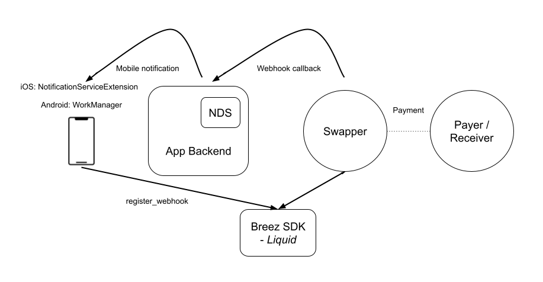

# Implementing mobile notifications

The Breez SDK - Nodeless *(Liquid Implementation)* Notification Plugin provides developers a simple solution to improve the payment experience on a mobile device. No longer does the application need to be in foreground when receiving payments. When the Notification Plugin is added to process push notifications, the application can be in the background or even closed.

## How it works

The process involves using a Notification Delivery Service (NDS) acting as an intermediary host by the application developer. The NDS must provide a public facing webhook URL where a POST request can be sent to when a notification needs to be delivered to the application. The NDS then forwards the data sent in the webhook POST request via push notification to the application. When the application then receives the push notification, the SDK Notification Plugin can be used to process the event.



### Push notification data

When receiving POST request data on the webhook URL, the NDS should get the `token`, `platform` and optional `app_data` from the URL params. If necessary, convert the token into a token compatible with the push notification service. For example, if the application uses a different token identifier in the webhook URL, it will perform an internal lookup to convert this token into a push notification service token upon receiving the POST request. Then format the data to be sent to the push notification service, which includes converting any JSON data into a string format. 

By default, the Notification Plugin should receive the push notification data in the following format:

```json
{
    "notification_type": "swap_updated",
    "notification_payload": "{ \"id\": \"\", \"status\": \"\" }",
    "app_data": ""
}
```
The structure and fields of this data can be changed by [customising the push messages](custom_messages.md) handled in the Notification Plugin to reflect how your NDS sends this data over push notifications.

## Use cases

The Notification Plugin handles several use cases by default to automatically process push notifications sent via the NDS when an SDK service calls the registered webhook. If your use case isn't covered by the Notification Plugin, you can extend the plugin to [handle custom notifications](custom_notifications.md).

### Updating a swap

When making a payment via lightning or a Bitcoin onchain address, the SDK uses a swap service to convert between the Liquid sidechain and Bitcoin onchain or Lightning. A swap service is used to monitor changes to the swap status and send push notifications to wake the device to progress the swap. When the Notification Plugin receives this notification from the NDS, it will start the SDK and let the SDK complete the swap or progress it to the next state. 

The `swap_updated` notification type will be received by the webhook in the following format:
```json
{
    "event": "swap.update",
    "data": {  
        "id": "",    // The hashed id of the swap
        "status": "" // The latest swap status
    }
}
```
| Swap type | Possible received statuses |
|---|---|
| Submarine | `transaction.claim.pending`, `invoice.failedToPay`, `swap.expired`, `transaction.lockupFailed` |
| Reverse | `transaction.mempool` / `transaction.confirmed` _*_ |
| Chain | `transaction.server.confirmed`, `transaction.lockupFailed`, `transaction.failed` |

_* Depending if a zero-conf swap is accepted_

### Handling pay requests

Having the ability to process push notifications when the application is in the background or closed also opens up the ability to handle payment requests from a static BOLT12 offer, LNURL or Lightning address. 

#### BOLT12 invoice requests

When [creating a BOLT12 offer](/guide/receive_payment.html#bolt12-offer) the SDK uses a swap service to register the BOLT12 offer with. When the swap service receives an invoice request for this BOLT12 offer, it will send a webhook request to the [registered webhook](using_webhooks.md) to fetch an invoice from the SDK. The NDS then forwards this request via push notification to the Notification Plugin. Once the Notification Plugin receives this notification from the NDS, it will start the SDK and create a new BOLT12 invoice for this request. 

If you also want to have the BOLT12 offer accessible with a Lightning address, it needs to be registered alongside the webhook URL and username with the [LNURL-pay service](/guide/pay_service.md).

The `invoice_request` notification type will be received by the webhook in the following format:
```json
{
    "event": "invoice.request",
    "data": {  
        "offer": "",         // The BOLT12 offer
        "invoiceRequest": "" // The invoice request
    }
}
```
The NDS then adds a reply URL for the response to be returned to. The final data received by the Notification Plugin is in the following format:
```json
{
    "offer": "",           // The BOLT12 offer
    "invoice_request": "", // The invoice request
    "reply_url": ""        // The URL to reply to this request
}
```

#### LNURL-pay requests

To do this, the application also needs to register a webhook with an [LNURL-pay service](/guide/pay_service.md). When the LNURL service receives a request on the static LNURL address, it will forward it via the NDS to the application. The Notification Plugin handles the two-step flow for fulfilling these requests.

Firstly the LNURL service receives a request for LNURL-pay information to get the min/max amount that can be received. The LNURL service calls the registered webhook, and upon receiving this notification, the Notification Plugin will connect to the Breez SDK and send a response back to the LNURL service based on the swap service limits. 

The `lnurlpay_info` notification type will be received by the webhook in the following format:
```json
{
    "template": "lnurlpay_info",
    "data": {  
        "callback_url": "", // The URL of the LNURL service
        "reply_url": ""     // The URL to reply to this request
    }
}
```
Secondly the LNURL service receives a request for an invoice based on the selected payment amount. The LNURL service calls the registered webhook, and upon receiving this notification, the Notification Plugin will start the SDK and call receive payment for the requested amount. The resulting invoice is then returned to the LNURL service. 

The `lnurlpay_invoice` notification type will be received by the webhook in the following format:
```json
{
    "template": "lnurlpay_invoice",
    "data": {  
        "amount": 0,    // The amount in millisatoshis within the min/max sendable range
        "reply_url": "" // The URL to reply to this request
    }
}
```

## Next steps
- **[Setting up an NDS](setup_nds.md)** to receive webhook requests
- **[Using Webhooks](using_webhooks.md)** in your main application
- **[Integrating the plugin](setup_plugin.md)** using a notification service extension or foreground service
